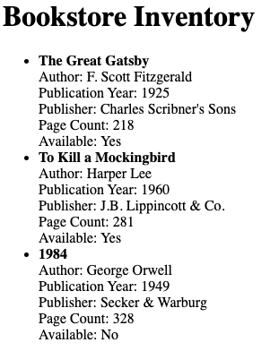
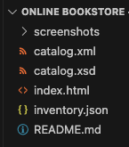

# 📚 Online Bookstore

An online bookstore catalog system that demonstrates the use of **XML Schema (XSD)**, **XML**, **JSON**, and **HTML** for data interchange between client and server.

---

## 🚀 Live Demo
You can access the live version of the project here:  
🔗 [GitHub Pages](https://andy-carrillo.github.io/bookstore-project/)  
🔗 [Netlify](https://bookstore-project-ac.netlify.app)

---

## ✅ Features
- 📦 **XML Schema (XSD)** definition for the bookstore catalog structure.
- 📝 **XML document** validated against the XSD schema.
- 📚 **JSON structure** representing the bookstore inventory.
- 🌐 **HTML page** that fetches and displays the inventory from the JSON file.
- 💡 Demonstrates **XML Namespaces** (explained in the documentation).
- 🔍 Comparison between **XML and JSON** for data interchange.

---

## 📖 How to Use
1. Open `index.html` in a browser (or access the live demo links).
2. The page will fetch the data from `inventory.json` and display the list of books.
3. View the `catalog.xml` and `catalog.xsd` files to see the XML and schema structure.

---

## 🛠️ Technologies Used
- 🖥️ **HTML5** → Structure of the web page.
- 🎨 **CSS3** (optional) → Not applied in this example, but can be extended.
- ⚡ **JavaScript (ES6)** → Fetch API to retrieve and display JSON data.
- 🗂️ **XML/XSD** → Bookstore catalog data structure definition and validation.
- 🗃️ **JSON** → Lightweight data interchange format for the bookstore inventory.
- 🚀 **GitHub Pages** and **Netlify** → Deployment of the live demos.

---

## 📸 Screenshots

### 🖥️ Bookstore Inventory Page  

_The bookstore inventory displayed using data from `inventory.json`._

### 💻 Project Structure in VS Code  

_Project folder with `catalog.xml`, `catalog.xsd`, `inventory.json`, and `index.html`._

---

## 👨‍💻 Author  
Developed by **Andrés Carrillo Casanova**  
For educational purposes – *University of the People (UoPeople), Web Programming 1* 📚

---